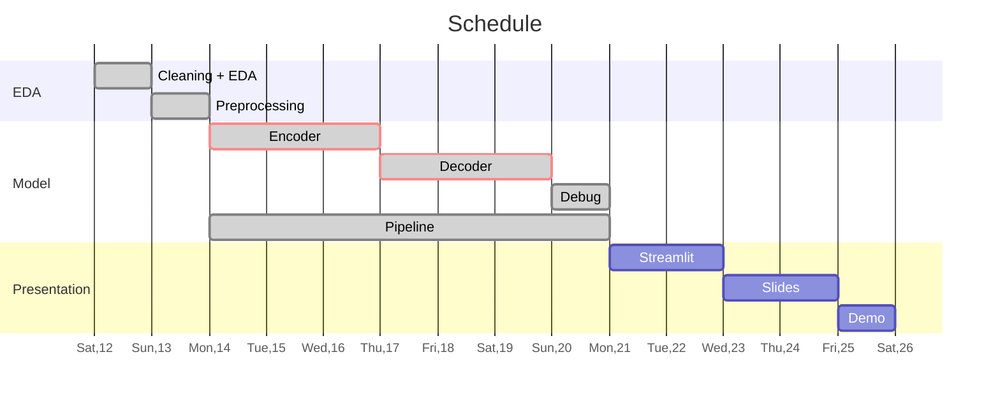

<style>
div#doc {max-width: 70%;}
.markdown-body { max-width: 100%; }
</style>
# HANDWRITTEN MATHEMATICAL EXPRESSION RECOGNITION

## Introduction

#### Problem
In today's increasingly digitized world, so too does the need for translating handwritings from an image to digital text. The recent boom in deep learning and neural networks has allowed for impressive results in optical character recognition (OCR). This has led to the development of multiple OCR systems for many natural languages like English, Arabic, and Chinese.

However, the language of mathematics presents its own set of challenges for OCR that are still being researched. While some impressive API has been commercialized (Mathpix, MyScript), these systems are closed source and use private datasets for training.

#### Proposal

In this project, I will try to develop a similar system to read, interpret, and translate handwritten mathematical expressions from images to $LaTeX$ code, which is the standard for digital math expression syntax. I will mostly be replicating one of the systems developed in a paper.

Essentially, my model will try to turn this
![HME_1](data:image/png;base64,iVBORw0KGgoAAAANSUhEUgAAAXQAAACHCAMAAAAxzFJiAAAAhFBMVEX///8AAADy8vL8/Pzj4+OxsbG5ubm9vb2tra319fWPj48KCgrv7+/W1tbn5+egoKB+fn6hoaFQUFBbW1s6OjrJyckmJibc3NzBwcE1NTWJiYmamppISEh4eHjT09NkZGQuLi4VFRUcHBxtbW1WVlZfX1+MjIxpaWk/Pz+Dg4MqKioYGBjT0ySJAAAMr0lEQVR4nO1d2WKqOhRlCyIgMqmAMkgFrbb//3+HgANhRmJij66X3ms9TbJIdvawEjjugw8++OCDDz744IMPPvjrMHSBdRfeDa69CiBk3Yv3whmMlHhYsO7HO8FeTtAPlXU/aGIdZmDW/n7JrGlm2EIOVu2/H+e6ATbTDqj7A9P2GeAAksQzbJ83YMeweRZYAGhse+CBzLYD1CGBy7oLILHuAWVI4LDuAmxZ94A2QGTdg/k36x7QhsvenLLeUejjYLDugQcT1l2gDP0FLPqadQ9oQ2c+0afwbslcgb27uAsoN8izfsgK84nOxZS9pxkkP2wTmWfm3ppMOTAyQZpYPtUmS9DYb2LHL5qtTW3kKv2wTK5NwGTYeo7dmWJjgW9OkMfGMjQR2AdG3I7irhLk44UpvSarEF4gLKFIunqpvrK1qW9Gunmp07CNB9+LdPmygy0+pNMj3djnxbH5kVaLtdBegXRqAamlZD94xm7ybMXee/mmFpAm+QxfM9M75Ni/QMVmr9BqKclHGzANRznui6nDmkGmJ11c5qNlXY/9Yl8PnlFb7PI8G63I2Lq8AukuNQ6MKPtBPZNcBtt4OAM90i/OyzfrZLZOM9lUj16ki4oy3rd+FdJdYKmlu3Sh+ztnsKzoNLbwcCWdtXl5gYh01q1hPGe9DKKRLV1Ip12oqkBbNSpOZJjjAP0pgdS0c6Ybl/xzEnGjciYX0ll7jKnr6jX8QgBjWsIW3Al5a3ToWu1XzjnHHuft5aQz9xiRjrHuUz4GSKofK4DSdOqUKPNdAalxr7Mo4w4s5KT77INwtTb5I8K0biHLEB+4CZANIdtPdU2jYm1rN+oIWEa68woim32dffmtNzoy4vvL50nOdLd1KxfBK/46hDHahYx0hb114ThvVf0sqjEtCCK43GlJ1qy3ZwFKu+x61HGNjPQXyDalpJ8qHx02td8UDgCqRdqxbyVdL+nWw1GtI9LLEmWDibGpku5CTRTCnyLwBSB/SqWN9AnMcJL90RtpqbkF7FhovSqkL+r2yQkE7hq57sT1YG2ka6XHvx7nvRjH1ELiw3UA4jF/8kFUSF9W/WbZhSzvrwL5im4L6XxS6tsaRp00DUHj3F/sowUbsVWF9Krgygny6cAvod7aj0EL6WrZu1uDNaqt05aL8SmlshG4VWd6Yb2tPc/bpXFSbsjTiU4+EdBC+qR8Kias220GIDy9wPkqhArpPCRoaKLn6Wc4rZSldPWU5WdI2VtID6MSx95IHzt1EV7jgg2togdwfDB1AP90OuAki884j9VCul/a4xajrRs4D29Kyv5XJ6fcqNlKtpvjucYh9imTvtKx/xUBonFt8dAQglwha1r9EN09mNIWYlL+pRf1/GLqwjwhmutPOihjkz58l/e1BIBZzeehHaBJuLBJ+Zd6TR6gDjJIId2NtEi6LJ5sZ2zahIfWjCavgzbR6jINcKnwmdHIHlzRl/Tvfco7+aC5hfToZvimBsBRHq3M4usm+vetpuFllnZxdxeuHoR0nWw6KZe5J+mzdG1PnkF680EUN8o3lnADW3QvSpF02dNNfeimWEe6srmZDDlvTs/znqG+vKS9hduwPbqka2gWPIN0pVnjNkl2pq6bwTVSL5Cu2nD6gqFuew3pMlRVKMitlA3YSXreoHl7LOqJkANTl9utIkINY6QTqmhbLWZW9jerjRXcGrXQkGV3F0VfO56bRoOLnVXSDxCVP0KPRoY5+qqFdm6p4Ns3VjcHoqU2fUdu1QqkyzYQkczIA6KVyRkmbhogHyRzXbOju/sohT0VVVWtnxFKhfTdaVupHaSk85diSabWKIaE7SWXAfiuZtQriLInfCedtxKBSHDXv0y8QHe6reAwa/KgHN1EiNH37Do7OK16jAKnVNI5vK1eaydBjAxr0VH9ITTVzc7dQc2TjHfSNTvt/pZEsqivfHSxBMUFWe7hs8qqKu/rSPfPStUgVUl3QLMuqxiRfsJ2+lLs8DA6/SA5OOVjvZGeUWWQ2Mr7ke4C7JwhYv5aI2B5WjV7XiX9eNBu4zykHcSs74YW6TfhG046kQMNvUg3o6NKoEFrW3PEq0I6D9tbVKqCOMftCTXS7avikhHp/CU9NLJBHtmcykZUQ3pBAhZCKbNKi/T7jl1Peoi2r0fT1H1IX15c+XGkyxGK73uRXlgNgY0vDVqk/9wq8jfS1+gQbJhzMAXkqa0elML2If3qPgwi3Yk3NpYpzbVsfUj/KuzC21K66YdQqamLdPuei/jFHnuETJ+aG0D1weMF3aRPxOtK60t66r4Iv9HK9DDSp9m06GPTvwpbp19Kf0krMtndDtInBeGdgQVE54i7e1TKY75MJ+kiwDVR0EX6REWYCBuAKJDLBYEki4KMstOolIMjuai1kcolBH4HIWpnbLq1I4uTFKYCLrhC9sW49urBY8CdpPvGbWpph/bVZF1uxfZUrdqXMJ/jHng47dty7udYNChBNYHuZm2MDcfDVqGcWFyQEnYfTjrzkttMePB4QRfp/E8hxWS2f1nVMtT3Q9rnP/V9HuK7EoIp8BvDvYx/jQyQAMVgyKjR+ajNjfRH+6ntZbEPZdLN6PZEnkR6Upx3Y9yXwiKFsyQl8GOnmM8458cCEz0AP1MK7LBCR/y0G5DiluSLjO08ZdK394nwKOntilARy96OIT24ux3u797wi0Z5+mXbe2ObOS0JRrr6NNHdpOVAiIfRXCa9oCIRVg9pO7/bq454g+HjlfFj33+6pKX5qlHSXYFnPsukh3eivYfeM9B1IQXeIOftH2mEQx5t3yrTktbR2pahb7EIrLKR3mE/VFPhO/LDpdM54aNXKchKX+NnzR9sYjBOjVniMzbM8mq//3fw2As1ukif4mtwSV5LWYZE7S6Y5iwxbu5x0pcF0jGNoCr1XaJdpK+wfXYxUsv4WmgkXcBtIUa6WDyAB/kpchX5vqv+UqwO0mf4yQvWt+OQRSPpJX2PVDR4UIyX1z74fjKH+dywvf51vA7SEzzwk55vXSiihXQ8U1f06KGkr1eUtTnYpWslvexzAKEC5WugL+lm0cRCj4J2F/h9m5VWcef6/7IuvUmH4vdIqNVPDYcnc/Ax1sR7ko4fjSBw0R7fIRnDk3zvSnqRIyKktweKIbHUywti1bRDLTC7TZ30gnCXe4W3dxCF38TfLxYR4qQ748XqnaTrxcldq9f/s6gUpa4Q8bIscdVuJ+l4YPBfvXs6alLO/uK3lT2B9I44qljV6qgb/TVsGlLI5eMu5Em3u6Kpu5P6Ai/BIoomBc2iNLeIky50ZrDMm/vE/GY/wrAa9tEy6XL5NO1YxN3Hzs/X1RazvtmvBhKnTsXpQ6Q4TbFlmXTiL/ZLeiRT4ku16AV9lxhWPgDsHqk1WU33iZRIJ39MfdOju3Ke5orG36jk+nlxwE8Sf+SBhuxPWZt0voZo0rad4alHc/2wRLpK+sR0v8MkEphWkoyvXxhg+AkaRaAcFRglBEV/6nBAh7WyCNHZbodGit5v468S7AlWbqUYi6TfugRQjsfRrkt4WqQjECf5wqm9vqkWNQsMxTUyfuGPB8PqlV7z1cHrorvCxz+D/m4n+L53gRLZvjPj6EBw4WrVsyCyPlVDsuk8U1RjnwmDrhcL21ZGUbzYX8bQE0e60U62ru6K/6ifCyqvISjTnpIegL87F/lYDCF90XrtjIORTtq6MHgTqnEzKwauLXPFEm6/mUJ5RU6/uNROTX+KFWNnCOlxq8SKV/wb06RJZ/Lmm7tRCHAmN1CCsURInVoBlJLblj4GFDRgqea+VywgTDpGrlpgudevkiWdsnXJENxId7oeubfNcIbvJcQlrd0io6R4x2MwZAZV5NkVCMbl4g2xtZ45GA6D67T42z7Kxa2FwgKklHg+rA1RjtddToAhCZJ1n5Frqy8x/ZsR0euYNZ9BWJ+6HFcnuEbu3wwhqrfYJkC84M4A5hDXpaeoQcnOfpNMZwtM5BS8cXM4Yt+d9R1Q2Cgq1Zwz7PfusGC5tyWaLBYkHUaH+Rt/1XQWWZDMZrNOCoR5W2c1bWAF7cCoLqDAS+RpeXeLqO/4lgYByVu0+DmT15AIwf4V7tPuC3HM9eEV8HsGr68XD8m4G3Mpw1mSza1uGegxJQjEP1VfFhSyIVz11o3n4//SgA4Gb9COTtIQ4gnXUv8l8F/ftN+gFi29F3jzCksY9L1FaeT1538e4X+mIvkDiOdvvqExgG95f8pt+x8gvMKbxN4NrF/h/oaQfRZlsjdH/H8pjv8E1s94scUH7XiNTPabAZ19+MRFVLEAMNLI6CVea/U2WARGICq0M10ffPDBBx988MGj+AeDipYWjj4EywAAAABJRU5ErkJggg==)
into this
```
\int{g} = \lim_{n \to \infty} \int{g_n}
```
which can be visualized by a $LaTeX$ parser into this
$$
\int{g} = \lim_{n \to \infty} \int{g_n}
$$

## Model Architecture

My model will take a form an encoder-decoder architecture where the encoder has the job of reading the image and extracting the symbols, which the decoder will take as input and parse into a $LaTeX$ code snippet.

It will look something like this:


As shown above, the encoder will take the form of a CNN (VGG, DenseNet) to extract features from the image, and the decoder will be an RNN (LSTM, Transformer) to parse those features. The decoder may or may not be equipped with the attention mechanism depending on the time constraints.

## Dataset

The dataset I will be using is the official [CROHME](https://www.isical.ac.in/~crohme/CROHME_data.html) dataset used as benchmark for most of the research efforts so far.

The CROHME datasets over multiple competitions have been compiled at [this kaggle dataset](https://www.kaggle.com/rtatman/handwritten-mathematical-expressions), which I will choose for ease of use.

Extra datasets for symbol segmentation/classification can be found below:

-    [Handwritten math symbols](https://www.kaggle.com/xainano/handwrittenmathsymbols)
-    [Handwritten math symbols and digits (smaller)](https://www.kaggle.com/clarencezhao/handwritten-math-symbol-dataset)

## Timeline


#### Checklist
-    [x] Cleaning + EDA
-    [x] Preprocessing data
-    [x] CNN encoder
-    [x] Attention mechanism
-    [x] RNN decoder
-    [x] Finishing training
-    [x] Finalizing the pipeline + debugging
-    [x] Streamlit interface and deployment
-    [ ] Presentation slides
-    [ ] DONE :100: (Hope to god I get here)

## Code
-    [Colab Notebook](https://colab.research.google.com/drive/1Frh8sH2iybM7fK733dA5yHG4lYrcCNik?usp=sharing)


## References
1. [Watch, Attend, Parse](http://home.ustc.edu.cn/~xysszjs/paper/PR2017.pdf)
2. [Multi-Scale Attention with Dense Encoder for
Handwritten Mathematical Expression Recognition](https://arxiv.org/pdf/1801.03530.pdf)
3. [Offline handwritten mathematical symbol
recognition utilising deep learning](https://arxiv.org/pdf/1910.07395.pdf)
4. [Neural Recognition of Handwritten Mathematical Expressions](https://epub.jku.at/obvulihs/download/pdf/3866590?originalFilename=true)
5. [Improving Attention-Based Handwritten
Mathematical Expression Recognition with Scale
Augmentation and Drop Attention](https://arxiv.org/pdf/2007.10092.pdf)